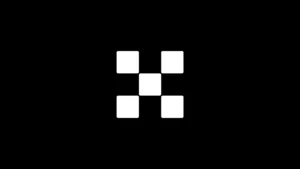
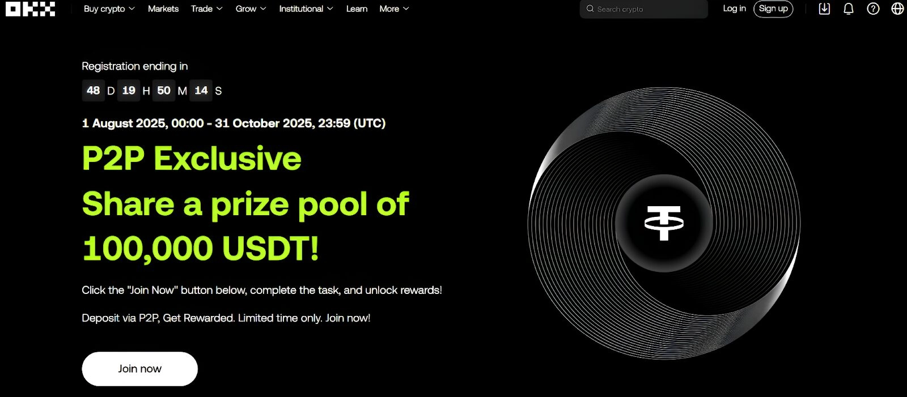
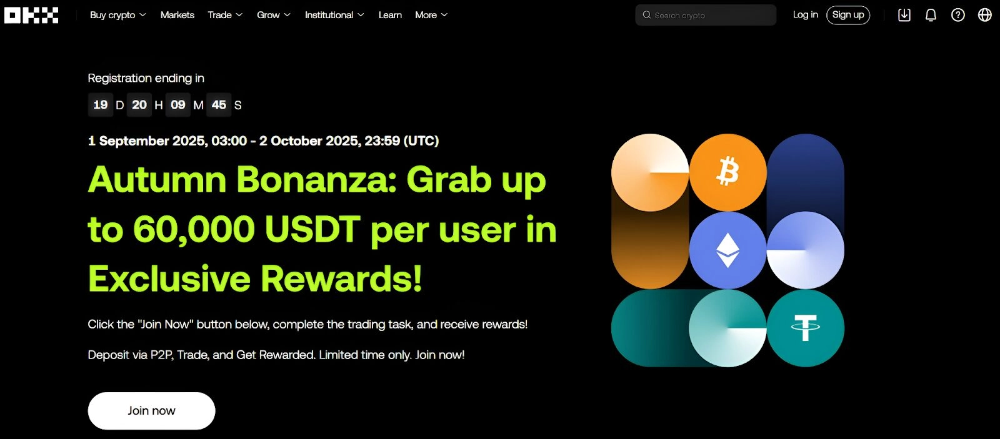
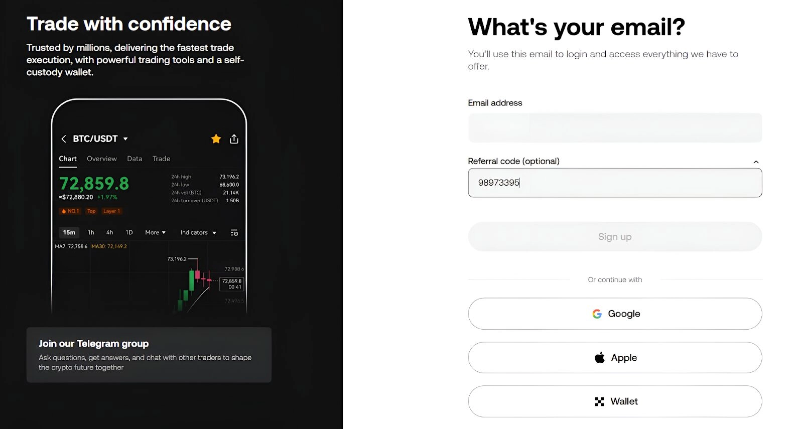
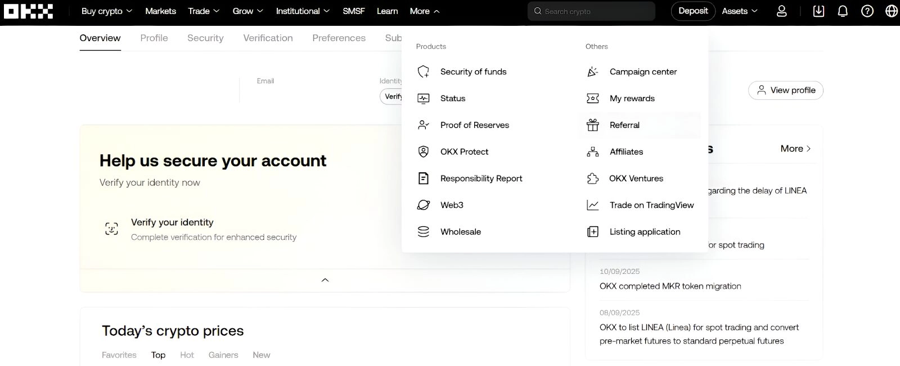

# OKX Referral Code "47044926" – Unlock Up to 10,000 USDT in Trading Rewards

Looking to maximize your crypto trading profits while cutting costs? Using an OKX referral code when you sign up isn't just about getting a welcome bonus—it's about unlocking ongoing fee discounts, mystery box rewards, and exclusive access to campaigns with massive prize pools. Whether you're new to crypto or an experienced trader, the right referral code can significantly boost your starting capital and reduce your trading expenses. Below, we'll show you exactly how to activate code "47044926" and what rewards you can expect.

---

## What Is an OKX Referral Code?

An OKX referral code is your ticket to exclusive rewards when joining the platform. It's a unique identifier—usually a string of numbers—that connects new users to existing members. When you register using someone's referral code, both parties benefit: you get sign-up bonuses, fee discounts, and mystery boxes, while the referrer earns commission from your trading activity.

Think of it like this: OKX wants to reward people for spreading the word. So they've created a system where everyone wins. Your referral code becomes your personal invitation tool once you're registered.

The code we're focusing on today is **"47044926"**. It's currently active and offers some of the best available rewards for new users.

## What Rewards Can You Actually Get?

Let's talk specifics. When you sign up with referral code "47044926," here's what's on the table:

### Welcome Bonus: Up to 100 USDT

After creating your account and completing identity verification, you become eligible for a welcome bonus. The exact amount depends on completing certain tasks—usually depositing funds and executing trades within a specific timeframe.

These tasks aren't complicated. For example, you might need to deposit $50 worth of crypto or complete a spot trade of a certain volume. The requirements change based on your location and the current campaign period, but they're designed to be achievable for most users.

### Trading Fee Discounts: Save 30%

This is where things get interesting. OKX frequently offers 30% rebates on trading fees as part of their welcome package. If you're planning to trade regularly, these savings add up fast.

Here's the math: Let's say you're a moderately active trader doing $10,000 in monthly volume. At standard rates (around 0.1% for takers), you'd pay $10 in fees. With a 30% discount, you're down to $7. That's $3 saved every month, $36 per year—just from using a referral code.

And it gets better. OKX uses a VIP tier system based on your trading volume and asset balance. As you trade more, your fees drop further. High-volume traders and institutional investors can score even deeper discounts, especially on complex trades like option combos through their RFQ system.

### Mystery Boxes: Free USDT Prizes

Who doesn't love a surprise? OKX regularly runs mystery box campaigns where each box contains crypto rewards—often up to $50 in USDT per box.

Current campaigns typically offer two mystery boxes: one when you complete KYC verification, another when you deposit at least 50 USDT within seven days of registration. Opening these boxes is like unwrapping a gift—you never know exactly what you'll get, but it's always something valuable.

## Current Campaigns Worth Joining

OKX runs multiple campaigns simultaneously, each with its own prize pool. Here are two major ones running now:

### P2P Exclusive Event: Share 100,000 USDT

This campaign specifically targets users who trade through OKX's peer-to-peer marketplace. For every qualifying task you complete—like making P2P deposits or executing trades—you earn redemption vouchers. Trade these vouchers for USDT rewards.

The beauty of this campaign? Rewards stack. Complete multiple tasks, collect multiple vouchers, redeem more USDT. The total prize pool sits at 100,000 USDT, so there's plenty to go around.

A few things to remember:
- Only P2P Express or Marketplace deposits count
- Each deposit must stay in your account for at least one day
- Zero-fee trades don't qualify
- Sub-accounts can't participate (only main accounts)

### Autumn Bonanza: Win Up to 60,000 USDT

This is the big one. The Autumn Bonanza campaign offers individual trading bonuses up to 60,000 USDT, with a total prize pool of 500,000 USDT. Your rewards scale with your cumulative trading volume:

- Trade 1,000 USDT → Get 1 USDT
- Trade 15,000 USDT → Get 2 USDT  
- Trade 100,000 USDT → Get 10 USDT
- Trade 1,000,000 USDT → Get 40 USDT
- Trade 50,000,000 USDT → Get an iPhone or 1,500 USDT
- Trade 500,000,000 USDT → Get 14,000 USDT
- Trade 800,000,000 USDT → Get 30,000 USDT

These bonuses work across spot trading, margin trading, futures, and options. The more you trade, the more you earn.

Important eligibility notes:
- Only new users who registered through affiliate referral links can join
- You must complete advanced KYC verification
- No prior trading history on OKX
- Users can only participate in one new user campaign at a time

👉 [Start earning campaign rewards with OKX's latest promotions here](https://www.okx.com/join/47044926)

## How to Activate Your Referral Code (Step-by-Step)

Alright, let's get you set up. The process is straightforward:

### Step 1: Create Your Account

Head to the OKX website or download their mobile app (available on both Android and iOS). Click the "Sign up" button—you'll find it in the top right corner.

First, select your country and state of residence. Check the terms and conditions box, then click "Create account."

Now comes the important part: Enter your email address and type **"47044926"** in the referral code field. Don't skip this step—entering the code during registration is crucial for claiming your bonuses.

After clicking "Sign up," OKX sends a verification code to your email. Enter it to verify. Then you'll authenticate your phone number via SMS. Finally, create a strong password and accept the terms to complete registration.

### Step 2: Verify Your Identity

Here's where KYC comes in. You won't be able to claim rewards or access all platform features without completing identity verification.

Click your profile icon and select "Verification." You'll need to complete two levels:

**Basic verification:** Enter your name, country, and date of birth. Upload a government-issued ID to confirm your identity.

**Advanced verification:** Submit a clear government-issued document (passport, driver's license, or national ID card). Take a selfie and complete facial recognition following the on-screen prompts.

The process usually takes just a few minutes. Once approved, you're ready to deposit and trade.

### Step 3: Make Your First Deposit

To unlock your welcome bonuses, you need to deposit funds within the specified timeframe—usually seven days from registration.

Click "Deposit" in the top right corner of your dashboard. OKX supports multiple deposit methods: crypto transfers, fiat deposits via bank transfer or debit/credit card, and P2P marketplace deposits.

Choose your preferred method and deposit the minimum required amount (often around $50 USDT). Some campaigns also require you to complete at least one trade, so check the specific task requirements for your region.

### Step 4: Claim Your Rewards

Once you've completed the required tasks, visit the OKX Rewards Center—accessible through both the website and mobile app.

Your bonuses should appear here, ready to claim. Click to activate them, but don't wait too long—most rewards expire within 30 days. Use them or lose them.

## Building Your Own Referral Network

Once you're registered, OKX gives you your own referral code and link. This is where things get interesting for anyone who wants to earn passive income.

### Finding Your Referral Code

Log in to your account and click the "More" tab. Select "Referral" from the dropdown menu. This takes you to your referral dashboard, where your unique invite code and link are displayed.

Share this code with friends, family, or your online network. Every time someone registers using your code and starts trading, you earn commission—typically a percentage of their trading fees.

### Understanding Referral Program Rules

Before you start inviting people, understand how the program works:

**Requirements for earning bonuses:**
- Your referees must sign up using your code or link
- They must complete KYC verification  
- They must finish required tasks within the deadline

**Limitations:**
- You can claim only five referral rewards per campaign period
- Rewards aren't tradeable or withdrawable immediately (lock-up periods apply)
- You may need to maintain a minimum account balance
- Reward amounts vary by campaign and market conditions

**Special programs:**

OKX offers a no-KYC referral program specifically for its decentralized exchange (DEX). You'll earn up to 50% of your referees' trading fees, instantly credited to your Web3 wallet.

For content creators and influencers, there's the OKX affiliate program. This offers up to 50% commission on trading fees, dedicated 24/7 support, and real-time tracking of invitees and earnings. The default commission rate is 30%, with a five-month protection period where your rate won't drop below your first month's percentage.

👉 [Join the OKX referral program and start earning commissions today](https://www.okx.com/join/47044926)

## What Makes OKX Worth Using?

Beyond the referral rewards, let's talk about why OKX has become one of the world's leading exchanges, serving over 50 million users across 100+ countries.

### Security First

OKX takes security seriously. They've implemented two-factor authentication, anti-phishing codes, withdrawal whitelisting, and cold storage for the majority of user funds. They also maintain proof-of-reserves transparency and a multi-billion-dollar insurance fund to protect users from extreme market events.

Their AI monitoring tools constantly scan for deepfakes, identify suspicious behavior, and prevent fraud before it happens. In an industry where exchange hacks make headlines regularly, OKX has maintained a solid security track record.

### Trading Options for Every Strategy

Whether you're a spot trader, futures enthusiast, or options strategist, OKX has you covered:

**Spot trading:** Over 300 coins and 688+ trading pairs, with leverage up to 10x available.

**Futures and options:** USDT-margined, USDC-margined, and coin-margined contracts across 387+ pairs. Plus BTCUSD and ETHUSD options.

**Trading bots:** Pre-built automation tools including spot grid, futures grid, iceberg orders, and smart arbitrage bots. Let algorithms handle the heavy lifting while you focus on strategy.

**Copy trading:** Mirror the strategies of expert traders. If you're a lead trader, earn up to 30% of your followers' profits weekly, plus perks like TradingView integration and fee discounts.

**Earn products:** Generate passive income on 100+ tokens. Simple Earn offers up to 6% APR on staked cryptocurrencies. Other products include BTC+ Yield, Dual Investment, and On-chain Earn.

**Flexible loans:** Borrow over 100 crypto assets at floating interest rates with flexible terms.

**P2P marketplace:** Zero-fee peer-to-peer trading with support for 100+ payment methods.

**Demo trading:** Practice strategies in a risk-free simulated environment—perfect for beginners.

**Web3 wallet:** A self-custody wallet supporting 130+ blockchains, giving you access to the OKX NFT marketplace and DEX.

### Competitive Fee Structure

OKX uses a VIP tier system based on asset balances and 30-day trading volumes. At the entry level, fees are 0.08% for makers and 0.1% for takers on USDT pairs—dropping to 0.05% and 0.07% for other pairs.

As your trading activity increases, fees decrease. High-volume traders enjoy significantly reduced rates, making OKX cost-competitive with other major exchanges.

No deposit fees. Withdrawal fees vary by cryptocurrency and network but remain reasonable compared to industry standards.

## Wrapping Up

Using referral code "47044926" when signing up for OKX isn't just about claiming a one-time bonus. It's about reducing your ongoing trading costs, accessing exclusive campaigns, and potentially building a passive income stream through your own referral network.

The combination of welcome bonuses, mystery box rewards, fee discounts, and campaign prizes creates meaningful value—especially if you're planning to trade regularly. And with OKX's robust security, diverse trading options, and competitive fees, you're joining a platform built for both beginners and professional traders.

So why wait? The campaigns won't last forever, and that welcome bonus is sitting there waiting for you to claim it. OKX offers a comprehensive trading ecosystem where rewards, security, and functionality come together—making it an ideal choice for anyone serious about cryptocurrency trading in a cost-effective environment with ongoing incentive programs.
  
---

## Frequently Asked Questions

**What is the best referral code for OKX?**

The referral code **"47044926"** currently offers excellent benefits for new users, including eligibility for up to $10,000 in bonuses, 30% trading fee discounts, and mystery boxes containing up to $50 USDT. After registration, you'll receive your own referral code to share with others and earn commissions when they start trading.

**Does OKX have a welcome bonus?**

Yes, new users can claim sign-up bonuses after completing required deposit and trading tasks. Welcome rewards typically include mystery boxes, reduced trading fees, contract vouchers, and USDT bonuses. The exact rewards vary based on your location and the current campaign period.

**Where can I find my OKX invite code?**

Your invite code and link are displayed in your referral dashboard. Access it by clicking "More" then "Referral" from the main menu. The dashboard shows detailed statistics including the number of registrations using your code, your referees' activities, pending bonuses, and cumulative earnings.

**If I already have an OKX account, can I use a new code?**

No. Each account can only use one referral code, entered during initial registration. If you want to use a different OKX code, you would need to create a new account. Referral codes cannot be added or changed after account creation.

**Why didn't I receive my bonus even though I met the requirements?**

Several factors could prevent bonus distribution: entering the referral code incorrectly during signup, attempting to use a code on an existing account (codes only work for new users), failing to complete KYC verification, or not finishing required tasks within the specified timeframe. Referral codes also cannot be stacked—only one code per account is allowed.
